<div align="center">


<!-- Glitch Effect Name -->
<div align="center">

```
█████╗ ██████╗ ██╗  ██╗ █████╗ ██╗   ██╗    ██╗  ██╗ █████╗ ███╗   ██╗ ██████╗██╗  ██╗ █████╗ ████████╗███████╗
██╔══██╗██╔══██╗██║  ██║██╔══██╗╚██╗ ██╔╝    ██║  ██║██╔══██╗████╗  ██║██╔════╝██║  ██║██╔══██╗╚══██╔══╝██╔════╝
███████║██████╔╝███████║███████║ ╚████╔╝     ███████║███████║██╔██╗ ██║██║     ███████║███████║   ██║   █████╗  
██╔══██║██╔══██╗██╔══██║██╔══██║  ╚██╔╝      ██╔══██║██╔══██║██║╚██╗██║██║     ██╔══██║██╔══██║   ██║   ██╔══╝  
██║  ██║██████╔╝██║  ██║██║  ██║   ██║       ██║  ██║██║  ██║██║ ╚████║╚██████╗██║  ██║██║  ██║   ██║   ███████╗
╚═╝  ╚═╝╚═════╝ ╚═╝  ╚═╝╚═╝  ╚═╝   ╚═╝       ╚═╝  ╚═╝╚═╝  ╚═╝╚═╝  ╚═══╝ ╚═════╝╚═╝  ╚═╝╚═╝  ╚═╝   ╚═╝   ╚══════╝
```


</div>

<br>

<!-- Interactive Terminal Style Profile -->
<div align="center">

```bash
┌──(abhay㉿creative-dev)-[~/profile]
└─$ ./whoami.sh

> Initializing profile...
> Loading credentials...
> Decrypting talents...

┏━━━━━━━━━━━━━━━━━━━━━━━━━━━━━━━━━━━━━━━━━━━━━━━━━━━━━━━━━━━━━━━━━━━━━┓
┃  👨‍💻  ABHAY HANCHATE                                                  ┃
┃  📍  Mumbai, India  |  🎓 SIES GST (AI & DS '28)                     ┃
┃  💼  Freelancer @ ACME Infocom Services                              ┃
┃  🚀  Ex-Web Developer Intern @ Walstar Technologies                  ┃
┣━━━━━━━━━━━━━━━━━━━━━━━━━━━━━━━━━━━━━━━━━━━━━━━━━━━━━━━━━━━━━━━━━━━━━┫
┃                                                                       ┃
┃  🎯  CURRENT_MISSION = "Building experiences that matter"            ┃
┃  ⚡  SUPERPOWER = "Turning caffeine into clean code"                 ┃
┃  🌈  VIBE = "Design-first, performance-obsessed"                     ┃
┃                                                                       ┃
┗━━━━━━━━━━━━━━━━━━━━━━━━━━━━━━━━━━━━━━━━━━━━━━━━━━━━━━━━━━━━━━━━━━━━━┛

> Profile loaded successfully ✓
```

</div>

<br>

<!-- Unique "What Makes Me Different" Section -->
<div align="center">

## ⚡ WHY I'M NOT LIKE THE REST

<table>
<tr>
<td width="33%" align="center">

### 🎨 DESIGNER FIRST
**Then Developer**

I don't just write code—
I craft **experiences**.

Every pixel matters.
Every animation tells a story.
Every interaction is intentional.

*Design isn't what I do.
It's how I think.*

</td>
<td width="33%" align="center">

### 🧠 AI-POWERED
**Human-Centered**

B.Tech in AI & Data Science
isn't just a degree—
it's my **secret weapon**.

I build smart, not just functional.
Predictive, not just reactive.
Intelligent, not just automated.

*The future is intelligent.
I'm building it.*

</td>
<td width="33%" align="center">

### 💼 BATTLE-TESTED
**Not Just Learning**

Real clients. Real deadlines.
Real-world production code.

Interned at **Walstar Tech**.
Freelancing for **real businesses**.
Solving **actual problems**.

*I don't just practice.
I deliver.*

</td>
</tr>
</table>

</div>

<br>

<!-- Interactive Code Block Philosophy -->
<div align="center">

## 🧬 MY CODE DNA

</div>

```javascript
class AbhayHanchate extends Developer {
  constructor() {
    super({
      name: "Abhay Hanchate",
      location: "Mumbai, India 📍",
      education: "B.Tech (AI & DS) '28 @ SIES GST",
      status: "Open for Freelance & Collaboration 🟢"
    });
    
    this.mindset = {
      designPhilosophy: "Form follows function, but make it beautiful",
      codingStyle: "Clean, modular, and maintainable",
      approach: "User-first, performance-obsessed",
      learningMode: "Always ON 🔥"
    };
    
    this.currentlyBuilding = [
      "🎨 Stunning UI/UX that users actually love",
      "⚡ Lightning-fast web applications",
      "🤖 AI-powered features that make sense",
      "💼 My freelance empire, one project at a time"
    ];
    
    this.notJustAnother = {
      developer: false, // I'm more than that
      designer: false,  // I'm more than that too
      aiEngineer: false, // Still more...
      creator: true // ← THIS IS ME
    };
  }
  
  work() {
    return this.passion + this.skills + this.coffee;
  }
  
  believe() {
    return "Great design is invisible. Great code is maintainable. Great impact is inevitable.";
  }
}

const me = new AbhayHanchate();
console.log(me.work()); // → ✨ Magic happens
```

<br>

<!-- Skill Constellation (Visual, Not Charts) -->
<div align="center">

## 🌌 MY TECH UNIVERSE

</div>

<div align="center">

```
                                    ✦ GSAP
                            ✦ Three.js        ✦ Animation
                    ✦ React                           
            ✦ Tailwind                    ✦ Bootstrap
                                                            ✦ jQuery
        ✦ JavaScript ═══════════════════════════════════════════════ ✦ HTML/CSS
                                    ★
                              DESIGN × CODE
                                    ★
        ✦ AI/ML ════════════════════════════════════════════════════ ✦ Python
                                                            ✦ TensorFlow
            ✦ MongoDB                     ✦ MySQL
                    ✦ Node.js                         
                            ✦ Express         ✦ REST APIs
                                    ✦ Git/GitHub
```

**Not just tools. My creative arsenal. 🎯**

</div>

<br>

<!-- What I Actually Do (Story Format) -->
<div align="center">

## 🎬 WHAT I ACTUALLY DO

</div>

<table width="100%">
<tr>
<td width="50%" valign="top">

### 🎨 **THE DESIGN SIDE**

```css
/* I think in design systems */
.my-approach {
  user-experience: first-class;
  aesthetics: modern-minimal;
  interactions: smooth-and-intentional;
  animations: purposeful-not-gimmicky;
  typography: carefully-chosen;
  colors: psychologically-considered;
  spacing: mathematically-precise;
  accessibility: always-included;
}

/* Every. Single. Pixel. Matters. */
```

**Projects I Love:**
- 🎭 Brand identities that tell stories
- 🖼️ Web designs that feel alive
- 🎯 UI/UX that users don't even notice (because it just works)
- ✨ Interactions that spark joy

</td>
<td width="50%" valign="top">

### ⚡ **THE CODE SIDE**

```python
# I build with purpose
def my_development_process():
    idea = brainstorm_with_coffee()
    design = sketch_until_perfect()
    prototype = build_fast_iterate_faster()
    code = write_clean_maintainable_scalable()
    test = break_it_before_users_do()
    deploy = ship_with_confidence()
    iterate = never_stop_improving()
    
    return success_story

# Clean code is happy code
```

**What I Build:**
- 🚀 Web apps that feel like native apps
- 💼 Client websites that convert
- 🤖 AI features that enhance UX
- 🎨 Interactive experiences that wow

</td>
</tr>
</table>

<br>

<!-- Real Talk Section -->
<div align="center">

## 💬 REAL TALK

</div>

<div align="center">

| 🎯 WHAT OTHERS DO | ⚡ WHAT I DO |
|:-----------------|:------------|
| Follow tutorials | Build from imagination |
| Copy templates | Design custom solutions |
| Use default styles | Craft unique experiences |
| Code → then design | Design → then code |
| "It works" | "It works beautifully" |
| Feature-focused | User-focused |
| Ship and forget | Ship and improve |
| Developer **or** Designer | Developer **×** Designer |

</div>

<br>

<!-- Interactive Timeline -->
<div align="center">

## 🚀 MY JOURNEY (SO FAR)

```mermaid
graph LR
    A[🎓 Started<br/>B.Tech AI & DS] -->|Learned to code| B[💡 Discovered<br/>Web Design]
    B -->|Fell in love| C[🔨 Built Projects]
    C -->|Got real experience| D[💼 Walstar Tech<br/>Internship]
    D -->|Leveled up| E[🎨 Started<br/>Freelancing]
    E -->|Currently| F[🚀 Building<br/>My Empire]
    F -.->|Next| G[🌟 Your Project?]
    
    style A fill:#7C3AED
    style B fill:#8B5CF6
    style C fill:#A78BFA
    style D fill:#C084FC
    style E fill:#A78BFA
    style F fill:#8B5CF6
    style G fill:#7C3AED
```



</div>

<br>

<!-- My Stack (Creative Format) -->
<div align="center">

## 🎯 HOW I BUILD THINGS

</div>

```
┌─────────────────────── THE FRONTEND LAYER ───────────────────────┐
│                                                                   │
│  🎨 DESIGN TOOLS          →  Figma, Adobe XD, Photoshop         │
│  💅 STYLING               →  Tailwind, CSS3, SASS                │
│  ⚡ INTERACTIVITY         →  JavaScript (ES6+), TypeScript       │
│  🏗️ FRAMEWORKS            →  React, jQuery                       │
│  ✨ ANIMATIONS            →  GSAP, Three.js, Framer Motion       │
│  📱 RESPONSIVE            →  Mobile-first, Adaptive Design       │
│                                                                   │
└───────────────────────────────────────────────────────────────────┘

┌─────────────────────── THE BACKEND LAYER ────────────────────────┐
│                                                                   │
│  🔧 RUNTIME               →  Node.js, Express                     │
│  🗄️ DATABASES             →  MongoDB, MySQL                      │
│  🔌 APIs                  →  REST, GraphQL                        │
│  🔐 AUTH                  →  JWT, OAuth                           │
│                                                                   │
└───────────────────────────────────────────────────────────────────┘

┌──────────────────────── THE AI/ML LAYER ─────────────────────────┐
│                                                                   │
│  🤖 FRAMEWORKS            →  TensorFlow, Scikit-learn             │
│  📊 DATA SCIENCE          →  Pandas, NumPy, Matplotlib            │
│  🧠 APPLICATIONS          →  Predictive Models, Smart Features   │
│                                                                   │
└───────────────────────────────────────────────────────────────────┘

┌───────────────────────── THE TOOLS LAYER ────────────────────────┐
│                                                                   │
│  🛠️ VERSION CONTROL       →  Git, GitHub                         │
│  📦 PACKAGE MANAGERS      →  npm, yarn                            │
│  🚀 DEPLOYMENT            →  Vercel, Netlify, AWS                 │
│  🎯 OTHERS                →  VS Code, Android Studio              │
│                                                                   │
└───────────────────────────────────────────────────────────────────┘
```

<br>

<!-- Philosophy Section -->
<div align="center">

## 🎭 MY CREATIVE PHILOSOPHY

</div>

<table width="100%">
<tr>
<td width="25%" align="center">

### 🎨
**DESIGN**

Beautiful isn't enough.
It must be **functional**.

Aesthetic meets
**usability**.

</td>
<td width="25%" align="center">

### ⚡
**PERFORMANCE**

Pretty is pointless
if it's **slow**.

Optimized code.
Lightning fast.

</td>
<td width="25%" align="center">

### 🧠
**INTELLIGENCE**

Smart features.
Predictive UX.

AI where it
**makes sense**.

</td>
<td width="25%" align="center">

### 💡
**INNOVATION**

Don't follow trends.
**Set them**.

Be different.
Be memorable.

</td>
</tr>
</table>

<br>

<!-- Current Mode -->
<div align="center">

## 🔥 CURRENT MODE: ACTIVE

</div>

```yaml
🌱 Learning:
  - Advanced React patterns & architecture
  - AI/ML model deployment in production
  - Advanced GSAP animations & Three.js 3D
  - Design systems & component libraries

💼 Working On:
  - Freelance client projects (web design & development)
  - Personal portfolio website (cooking something special 👀)
  - AI-powered web tools
  - Open-source contributions

🎯 Looking For:
  - Freelance web development projects
  - UI/UX design collaborations
  - Full-stack development opportunities
  - Interesting problems to solve

⚡ Available For:
  - Custom website design & development
  - React/Frontend development
  - UI/UX design projects
  - AI/ML integration consulting
```

<br>

<!-- Connect Section (Unique Style) -->
<div align="center">

## 📡 LET'S CONNECT

</div>

<div align="center">

```
╔════════════════════════════════════════════════════════════════╗
║                                                                ║
║  💼  Work Together  →  Freelance Projects & Collaborations    ║
║  🤝  Network        →  Let's connect on LinkedIn              ║
║  💻  Code           →  Check out my GitHub                    ║
║  📧  Contact        →  Slide into my DMs                      ║
║  🎨  Portfolio      →  See my work (coming soon™)             ║
║                                                                ║
╚════════════════════════════════════════════════════════════════╝
```

<br>

<a href="https://github.com/SnippyKid">
  
</a>
<a href="https://www.linkedin.com/in/abhay-hanchate">
  
</a>
<a href="mailto:your.email@example.com">
  
</a>

<br><br>

### 🎯 **OPEN TO:**


</div>

<br><br>

<!-- Unique Footer Quote -->
<div align="center">

```
┌─────────────────────────────────────────────────────────────────────┐
│                                                                     │
│   "I don't just build websites. I craft digital experiences        │
│    that people remember, enjoy, and actually want to use."          │
│                                                                     │
│                                         — Abhay Hanchate            │
│                                                                     │
└─────────────────────────────────────────────────────────────────────┘
```

### ✨ *Design × Code × AI = The Future* ✨

<br>

<!-- Custom Footer -->


</div>

<!-- Easter Egg -->
<div align="center">
<sub>💜 Made with passion, coffee, and a lot of purple 💜</sub>
</div>
